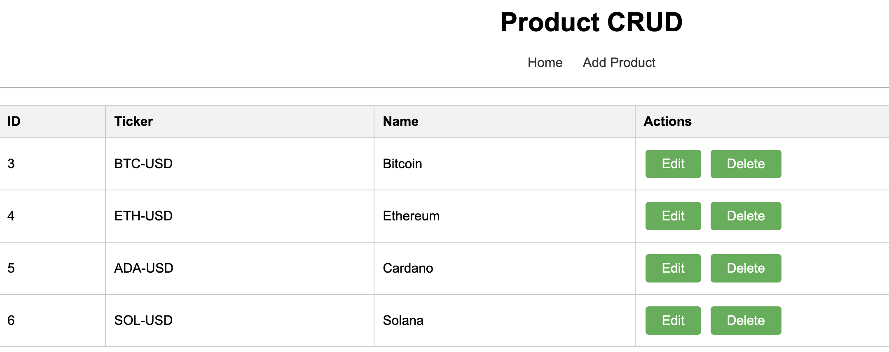
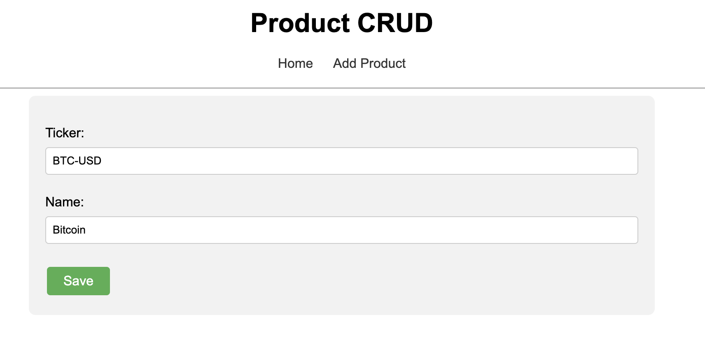
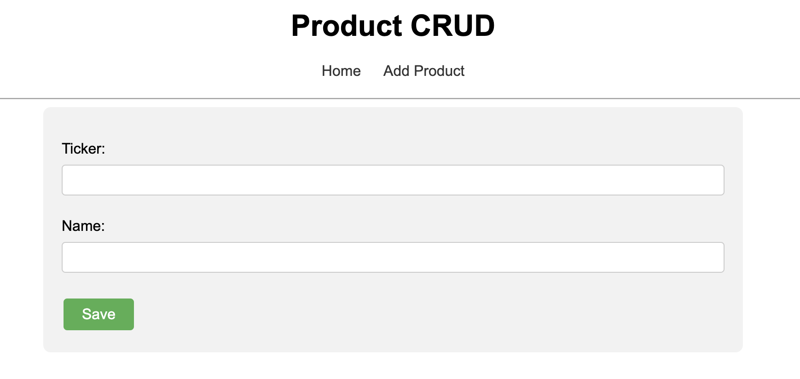
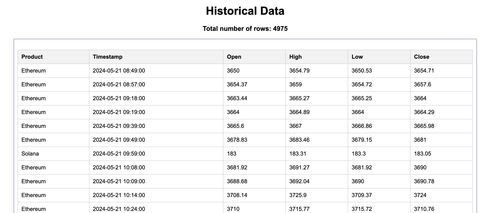

# Django CRUD Application with Celery and Coinbase API Integration

This project is a Django-based CRUD application that allows users to manage product data, fetch historical data from the Coinbase API, and display the data in a web interface. The project also includes a scheduled task using Celery to automatically fetch and store historical data every hour.

## Features

1.CRUD Operations on Product Table:Users can perform Create, Read, Update, and Delete operations on the Product Table via a user interface.

2.Data Extraction from Coinbase API: Historical data for specified products is extracted from the Coinbase API.

3.Data Storage: The extracted data is stored in a database with a predefined schema.

4.Task Scheduling with Celery: Automated task is scheduled to run every hour, extracting data from the Coinbase API and storing it in the database.

5.User Interface for Historical Data: A UI is created to display the historical data stored in the database, with real-time updates.

## UI Images

### Dashboard

The dashboard provides an overview of the product data and historical information fetched from the Coinbase API.

### Product UI

Users can perform CRUD operations on product data, including adding new products, updating existing ones, and deleting them.

1. Read and Delete product table

1. Update product table

3. Create product table

 
### Historical Data Display

The historical data section displays data fetched from the Coinbase API, with real-time updates.

 
## Prerequisites

Python 3.8+
Django 4.0+
Celery 5.0+
RabbitMQ (for Celery broker)

## Setup Instructions

Step 1: Clone the Repository

* git clone git clone https://Meghna1996@bitbucket.org/django-exercise/wisdomtree-assignment.git
* cd wisdom-tree-assignment/django\_crypto\_crawler

Step 2: Install Dependencies
Django>=4.0,<5.0
djangorestframework>=3.12.0,<4.0
celery>=5.0,<6.0
pika>=1.2.0,<2.0
requests>=2.25.0,<3.0
django-celery-beat>=2.2.0,<3.0
pytest-django>=4.0.0,<5.0
htmx>=1.5.0,<2.0
django-htmx>=0.2.0,<0.3.0

Step 3: Set Up Django Project

* Configure Settings: Update settings.py with database configuration.
* Run Migrations:python manage.py makemigrations
python manage.py migrate
* Create Superuser: python manage.py createsuperuser

Step 4: Set Up Celery

* Start RabbitMQ Server
* Start Celery Worker: celery -A django\_crypto\_crawler worker --loglevel=info
* Start Celery Beat: celery -A ngo\_crypto\_crawler beat -l info

Step 5: Run the Django Development Server

* python manage.py runserver

Step 6: Access the Application

* Open web browser and go to http://127.0.0.1:8000/ to access the application